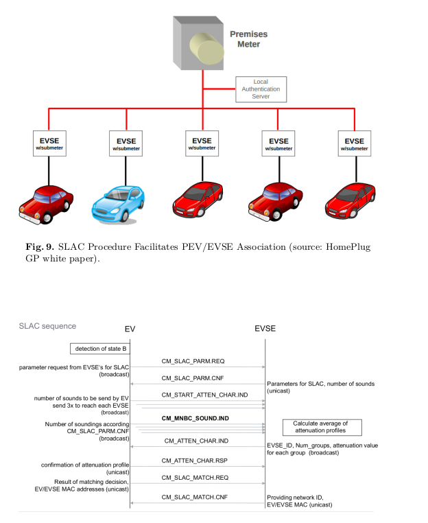

# libslac Iso15118-3 binding

=============================

WARNING: on going work, will probably not work for you

## Provides

* Rust implementation of libslac Iso15118-3
* afb-binding micro service architecture and security model [api-v4](https://github.com/redpesk-common/afb-librust/blob/master/docs/1-architecture_presentation.md)

## Build command

To build the project on a local computer:

```bash
cargo build --features  afbv4
```

## References

This code is freely inspired from differences open-sources references:

* Switch PySlac [1]
* Pionix SLAC   [2]
* Qualcomm [3]
* HomePlug(SLAC) [4] [5]

## Abbreviation

* AVLN/sub-AVLN: AV In-Home Logical Network
* STA: Network Station
* NMK: Network MemberShip Key
* NID: Network Identifier (7 bytes)
* SNID: Short Network ID (4bits)
* PEV: Plug-In Electric Vehicle
* EVSE: Electric Vehicle Supply Equipment (charger)
* CCo Capability (CCoCap) Spec: 4.4.3.14 p155
* HLE: Higher Layer Entity spec: 11.1 p 467
* HPGP: Homeplug Green PHY

## Few Security Concepts

* From spec definition, all stations sharing the same NMK/NID are assumed to be trustworthy.
* STA station from a sub-AVLN should be able to exchange confidential information not exposed outside sub-AVLN
* We assume that a neighbor may be able to eavesdrop on transmissions within a residence,
  and may also be able to send transmissions to stations within that residence, without the
  knowledge of the users in that residence
* The mechanism for generating the NID Offset from the NMK shall be the PBKDF1 using SHA-256.
  The iteration count used to calculate the NID Offset shall be 5. (see spec:p182)
* this process require CAP_NET_RAW

To add CAP_NET_RAW to afb-binder use

```bash
# afb-binder started from bash should have CAP_NET_RAW capability
sudo setcap cap_net_raw+eip /usr/local/bin/afb-binder

# when debugging from vscode/codium (use 'ps -ef | grep lldb-server' to find corresponding version)
for FILE in $HOME/.vscode-oss/extensions/vadimcn.vscode-lldb*/lldb/bin/lldb-server; do sudo setcap cap_net_raw+eip $FILE; done
```

## General Flow


[see Synacktiv V2G] [6]


## Simulating target network

### Without any real hardware equipment

While simulating full ISO15118 protocols remains complex, Qualcomm open-plc-tools provides
pev/evse commands to simulate Slac.

Create a fake network and start 'pev' on one side and 'slac-binding-rs' on the other side.
```
    Bridge  | vethA <- (evse -i vethA -K)
    (br0)   | vethB -> slac-binding-rs config.json:{"iface":"vethB"}
```

You may use following script to create your fake network
```bash
// create a virtual bridge for vethA & vethB
sudo ip link add br0 type bridge; \
sudo ip link set br0 up; \
for DEV in vethA:peerA vethB:peerB ; do \
  SRC=`echo $DEV | cut -f 1 -d :`
  DST=`echo $DEV | cut -f 2 -d :`
  echo "Connecting iface=$SRC to br0"; \
  sudo ip link add $SRC type veth peer name $DST; \
  sudo ip link set $SRC up; \
  sudo ip link set $DST up; \
  sudo ip link set $DST master br0; \
done
```

Wireshark debug on bridge interface
```bash
# if you're not member of wireshark group use su
su -c  "wireshark -i br0 -k -S"
```

### Target remote wireshark debug

When testing with a real car or a Trialog simulator, you should tap ethernet packets
directly from codico/eth2 on the target. Nevertheless it remains possible to tunnel
ethernet packets from the target to your desktop to leverage wireshark UI.

```bash
ssh root@phytec-power.tuxevse.vpn "tcpdump -s0 -U -n -w - -i eth2" | wireshark -i -
```
WARNING: wireshark require you to be member of 'wireshark' group. If not use su.

### Tapping codico/eth2 and debug natively on desktop

When debugging SLAC/ISO is far more convenient to tunnel directly the full Ethernet/Layer2
data on your desktop. This allow to source debug indifferently Slac,ISO-2/20,...

Tunneling a physical Ethernet interface require a 'not so simple' configuration. Luckily
the script located in ./afb-test/etc will address your need. With eth/tunneling you access
to codico/eth2 directly from your desktop as if you when running slac/iso-bindings on the target.

```
on target  => sudo ./afb-test/etc/server-eth2-tap.sh
on desktop => sudo ./afb-test/etc/client-eth2-tap.sh
```


## References

* [1]: Switch PySlac: <https://github.com/SwitchEV/pyslac>
* [2]: Pionix SLAC simple library <https://github.com/EVerest/libslac>
* [3]: Qualcomm Open-Pcl: <https://github.com/qca/open-plc-utils>
* [5] <https://docbox.etsi.org/Reference/homeplug_av11/homeplug_av11_specification_final_public.pdf>
* [5] <https://docbox.etsi.org/Reference/homeplug_av21/homeplug_av21_specification_final_public.pdf>
* [6]: Synacktiv V2G injector (<https://www.sstic.org/media/SSTIC2019/SSTIC-actes/v2g_injector_playing_with_electric_cars_and_chargi/SSTIC2019-Article-v2g_injector_playing_with_electric_cars_and_charging_stations_via_powerline-dudek.pdf>)


Fulup Trialog Notes:

* Qualcom tool EV send CM_SET_KEY.REQ
* Trialog envoie en direct CM_SLAC_PARM.REQ

1) Regarder la nogiciation Slac_PRM_REQUEST et la reponse
2) Regarder les packet m
sound